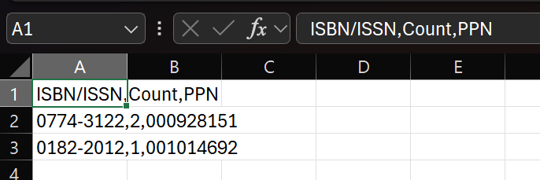
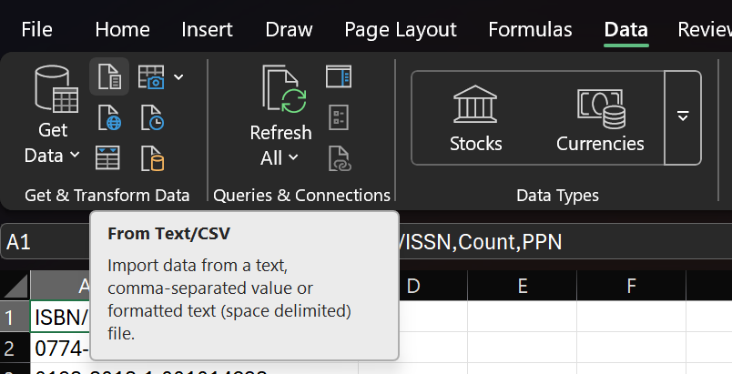
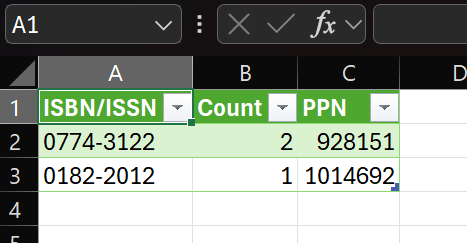

# easy_loc

A mobile application that returns which French university libraries (BU) have a book, based on its ISBN/ISSN.

## CSV Export

Use the default (RFC conform) configuration:

    , as field separator
    " as text delimiter and
    \r\n as eol.

Excel  by default use `;` as field separator. So it will give this (it can also have issues with the formatting) :

To correctly use the CSV format in excel follows these steps:
 1. Open Excel and go to the "Data" tab.
 2. Click on "Get Data" or "From Text/CSV".

 

 3. Select the CSV file you want to import.
 4. In the import dialog, make sure to set the delimiter to the comma (`,`) and click on load.

 

 5. Your all set. It should give something like this:

 
