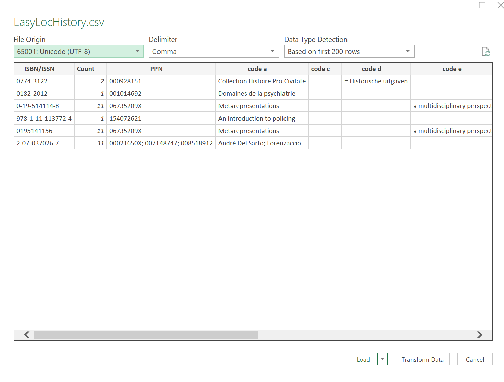

# easy_loc

Une application mobile qui indique quelles bibliothèques universitaires (BU) françaises possèdent un livre, basée sur son ISBN/ISSN.

## Fonctionnalités
- Scanner les codes-barres ISBN/ISSN avec l'appareil photo.
- Scanner les ISBN/ISSN à partir de texte.
- Liens Google Maps pour les bibliothèques possédant le livre.
- Support mode sombre/clair.
- Support multilingue (Français, Anglais)
- Historique des livres recherchés.
- Export de l'historique en CSV, incluant le nombre de bibliothèques, une liste des PPN associés, et le code UNIMARC 200 (dérivé du premier PPN de la liste).
- Partage du fichier d'historique.

### Export CSV

Utilise la configuration par défaut (conforme RFC) :

    , comme séparateur de champ
    " comme délimiteur de texte et
    \r\n comme fin de ligne.

Excel utilise par défaut `;` comme séparateur de champ. Cela donnera donc ceci (il peut aussi y avoir des problèmes de formatage) :

Pour utiliser correctement le format CSV dans Excel, suivez ces étapes :
 1. Ouvrez Excel et allez dans l'onglet "Données".
 2. Cliquez sur "Obtenir des données" ou "À partir du texte/CSV".

 

 3. Sélectionnez le fichier CSV que vous voulez importer.
 4. Dans la boîte de dialogue d'importation, assurez-vous de définir le délimiteur sur la virgule (`,`) et l'encodage sur unicode UTF-8, puis cliquez sur charger.

 

 5. Vous êtes prêt. Cela devrait donner quelque chose comme ceci :

 
